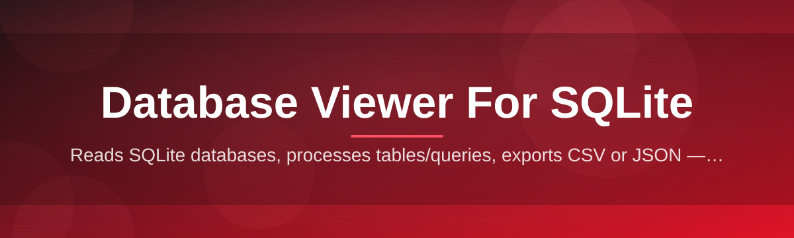

# sqlite-database-viewer-editor 🗃️🔍

  

*A no-nonsense SQLite database viewer and editor that opens your `.db` files faster than you can say "why is my table schema like this."*

  

---

## ⚡ Quick Start (For People Who Skip READMEs)

Look, I know you're not going to read this whole thing. Fine. Here's the tl;dr:

1. **Download** the app from the landing page (button's right below, can't miss it).

2. **Double-click** the executable. No installer wizard nagging you about a toolbar.

3. **Drag in your `.db`, `.sqlite`, or `.sqlite3` file** and start browsing tables like a civilized person.

Everything past this point is just me justifying why this tool exists. Read on if you're curious, or don't — the app doesn't judge.

---

## 🥊 This vs. Literally Everything Else

I built this because every other SQLite database viewer either felt like it was designed in 2011 and never updated, or required fourteen dependencies just to look at a `users` table. Here's the honest comparison:

| Tool | Setup Friction | UI Feel | Editing Support | Portable | Learning Curve |
|---|---|---|---|---|---|
| **sqlite-database-viewer-editor** | Zero — standalone `.exe` | Modern, dark-mode native | Full inline cell + schema editing | ✅ Yes | Minutes |
| DB Browser for SQLite | Installer + runtime bits | Functional but dated | Yes, but clunky dialogs | ⚠️ Partial | Moderate |
| Raw `sqlite3` CLI | None (already there) | It's a terminal | Yes, if you enjoy typing SQL blind | ✅ Yes | Steep |
| Generic "universal DB tool" suites | Heavy, plugin-based | Bloated, enterprise-y | Yes, buried in menus | ❌ Rarely | Steep |
| Browser-based online viewers | Upload your data to a stranger's server | Meh | Limited | ❌ No | Low |

> [!NOTE]
> This table is opinionated because *I'm* opinionated. Your mileage may vary, but I've used all of these enough to have earned the right to complain.

---

## 📖 What Even Is This Thing

**sqlite-database-viewer-editor** is exactly what the name says, with zero marketing spin: a desktop application for viewing and editing SQLite databases without touching a command line or spinning up a local server. SQLite is quietly the most deployed database engine on the planet — it's inside your browser, your phone apps, your desktop software — and yet browsing one still somehow feels harder than it should. This tool exists to fix that specific, tiny, extremely common annoyance.

It's built for developers debugging a local app's data store, QA folks who need to peek inside a `.sqlite` file without asking an engineer, data hobbyists poking around exported datasets, and students learning relational databases who just want to *see* the rows instead of squinting at terminal output. If you've ever opened a `.db` file in a hex editor out of desperation, this is the intervention you needed.

The philosophy here is simple: a SQLite database viewer and editor should open instantly, run without installing a runtime, and never phone home with your data. No cloud sync, no account creation, no "sign in to continue." Your database stays on your machine, because that's the entire point of using SQLite in the first place.

---

## 🧰 What's In The Toolbox

- **Instant schema inspection** — open any `.db` file and immediately see tables, indexes, triggers, and views laid out in a sidebar tree instead of running `.schema` and scrolling through terminal soup.

- **Inline cell editing** — click a cell, change the value, hit enter. No modal dialogs, no "confirm your edit" popups pretending to be helpful.

- **Live SQL query console** — write raw SQL when the GUI isn't enough, with syntax highlighting and query history so you're not retyping the same `SELECT` five times a day.

- **Multi-tab database browsing** — open several `.sqlite` files at once, because nobody debugs just one database at a time.

- **Export to CSV/JSON** — pull table data out for spreadsheets or scripts without writing a single export query.

- **Foreign key visualization** — see relationships between tables instead of reverse-engineering them from column names like a detective.

- **Undo-safe editing** — every edit is staged before commit, so a fat-fingered keystroke doesn't nuke your production-adjacent test data.

- **Dark and light themes** — because staring at a white grid at 1 AM is a crime against your eyes.

> [!TIP]
> Use the query console's history panel (`Ctrl+H`) to re-run yesterday's debugging query instead of remembering the exact `WHERE` clause you used.

---

## 🚀 Getting Off The Ground

1. Visit the landing page (link below) and grab the current build.

2. Run the executable — there's no installer, no admin prompt theater, no bundled toolbar you didn't ask for.

3. Open a database via `File → Open` or just drag the `.db`/`.sqlite`/`.sqlite3` file straight onto the window.

4. Browse tables, run queries, edit cells, export results — repeat as needed.

> [!IMPORTANT]
> This is a standalone Windows application. There's nothing to compile, no package manager involved, and no background service installed on your machine. Download, run, done.

---

## 📋 The Fine Print (Requirements Matrix)

| Component | Minimum | Recommended |
|---|---|---|
| **OS** | Windows 10 (64-bit) | Windows 11 |
| **RAM** | 2 GB | 4 GB+ (larger databases love RAM) |
| **Disk** | 150 MB free | 500 MB free (for exports & backups) |

  

> [!WARNING]
> Extremely large databases (multi-GB) will work, but table pagination is your friend. Loading a 10 million row table into a grid all at once will make any tool sweat, not just this one.

---

## ⚙️ Under The Hood

The workflow behind sqlite-database-viewer-editor is deliberately unglamorous — that's a compliment. It reads your database's actual file bytes, parses the schema, and renders everything through a lightweight UI layer without spawning any external processes or network calls.

1. **You open a file** — the app locates and validates the SQLite file header.

2. **The engine parses the schema** — tables, indexes, and relationships get mapped into memory.

3. **The UI renders the grid** — paginated, virtualized rows so scrolling stays smooth even on chunkier tables.

4. **You edit or query** — changes are staged in a transaction buffer before touching disk.

5. **Commit writes back** — SQLite's own file format handles the pers